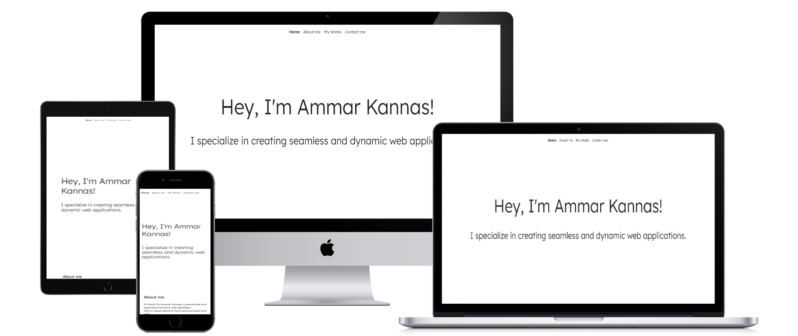
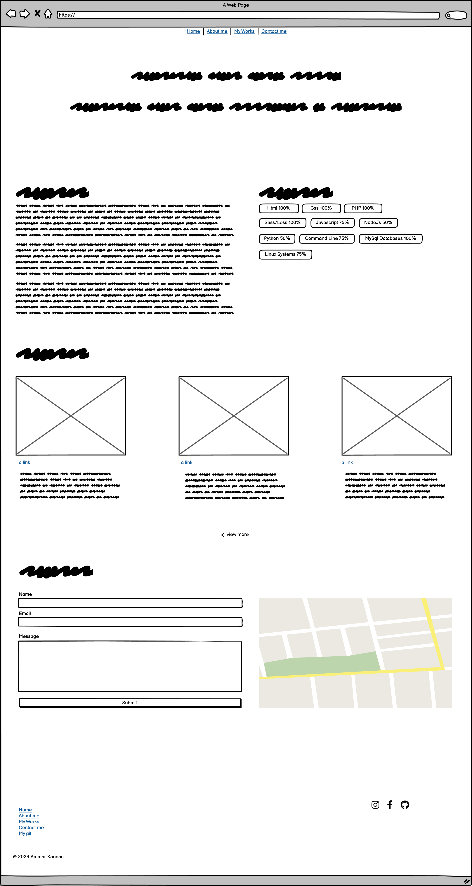
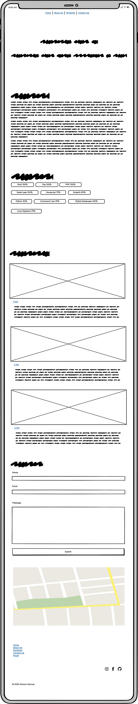

<h1 style="text-align: center;">Ammar Kannas's Portfolio Website</h1>

[View the live project here.](https://ammarkannas.github.io)

This is the main marketing site for myself and my services. It is designed to be responsive and accessible on a range of devices, making it easy to navigate for visitors and potential customers.

<h2 align="center"></h2>

## User Experience (UX)

-   ### User stories

    -   #### First Time Visitor Goals
        1. As a First Time Visitor, I want to be able to easily navigate throughout the site to find content.
        2. As a first-time visitor, I want to explore some of the work they have done, and the skills they have

    -   #### Returning Visitor Goals

        1. As a Returning Visitor, I want to find information about coding skills.
        2. As a Returning Visitor, I want to find the best way to get in contact with any questions I may have.
        3. As a Returning Visitor, I want to find community links.

    -   #### Frequent User Goals
        1. As a Frequent User, I want to check to see if there are any newly added works.
    
  - ### Design
      -   #### Colour Scheme
          -   <div style="color: #0d6efd;">Primary #0D6EFD</div>
          -   <div style="color: #6c757d;">Secondary #6C757D</div>
          -   <div style="color: #198754;">Success #198754</div>
      -   #### Typography
          -   The Lexend font is the main font used throughout the whole website with Sans Serif as the fallback font in case for any reason the font isn't being imported into the site correctly. Lexend is a clean font used frequently in programming, so it is both attractive and appropriate.
      -   #### Imagery
          - Skills and programming languages icons [Flaticon](https://www.flaticon.com)
          - My works image Microsoft copilot AI [Copilot](https://copilot.microsoft.com/)
*   ### Wireframes

    -   Desktop (Large screens)
        <h2 align="center"></h2>
    -   Mobile Phones (Small screens)
        <h2 align="center"></h2>

## Features

-   Responsive on all device sizes

-   Interactive elements

## Technologies Used

### Languages Used

-   [HTML5](https://en.wikipedia.org/wiki/HTML5)
-   [CSS3](https://en.wikipedia.org/wiki/Cascading_Style_Sheets)

### Frameworks, Libraries & Programs Used

1. [Bootstrap 5.3:](https://getbootstrap.com/docs/5.3/getting-started/introduction/)
    - Bootstrap was used to assist with the responsiveness and styling of the website.
1. [Google Fonts:](https://fonts.google.com/)
    - Google fonts were used to import the 'Lexend' font into the style.css file which is used on all pages throughout the project.
1. [Font Awesome:](https://fontawesome.com/)
    - Font Awesome was used on all pages throughout the website to add icons for aesthetic and UX purposes.
1. [jQuery:](https://jquery.com/)
    - jQuery came with Bootstrap to make the navbar responsive.
1. [Git](https://git-scm.com/)
    - Git was used for version control by utilizing the Gitpod terminal to commit to Git and Push to GitHub.
1. [GitHub:](https://github.com/)
    - GitHub is used to store the projects code after being pushed from Git.
1. [Balsamiq:](https://balsamiq.com/)
    - Balsamiq was used to create the [wireframes](https://github.com/ammarkannas/milestone-project-1/docs/wireframes) during the design process.

## Testing

The W3C Markup Validator and W3C CSS Validator Services were used to validate every page of the project to ensure there were no syntax errors in the project.

-   [W3C Markup Validator](https://jigsaw.w3.org/css-validator/#validate_by_input) - Document checking completed. No errors or warnings to show.

-   [W3C CSS Validator](https://jigsaw.w3.org/css-validator/#validate_by_input) - Document checking completed. No errors or warnings to show.


### Testing User Stories from User Experience (UX) Section

-   #### First Time Visitor Goals

    1. As a First Time Visitor, I want to easily understand the main purpose of the site and learn more.
        1. Upon entering the site, users are automatically greeted with a clean and easily readable navigation bar to go to the page of their choice. Underneath there is a Text and a "Learn More" Call to action button.
        2. The user has two options, click the call to action buttons or scroll down, both of which will lead to the same place, to learn more about me.

    2. As a First Time Visitor, I want to be able to easily be able to navigate throughout the site to find content.
        1. The site has been designed to be fluid and never to entrap the user. At the top of each page there is a clean navigation bar, each link describes what the page they will end up at clearly.
        2. On the Contact Us Page, after a form response is submitted, the page refreshes and the user is brought to the top of the page where the navigation bar is.

    3. As a first-time visitor, I want to explore some of the work they have done, and the skills they have
        1. Once the new visitor has read the About Us and What We Do text.
        2. The user can also scroll to the bottom of any page on the site to locate social media links in the footer.
        3. At the bottom of the Contact Us page, the user is told underneath the form, that alternatively they can contact me on social media which highlights the links to them.

-   #### Returning Visitor Goals

    1. As a Returning Visitor, I want to find the best way to get in contact with the developer with any questions I may have.

        1. The navigation bar clearly highlights the "Contact Us" Page.
        2. Here they can fill out the form on the page or are they can message the developer on social media.
        3. The footer contains links to the organisations Facebook, Twitter and Instagram page as well as the developer's.
        4. Whichever link they click, it will be open up in a new tab to ensure the user can easily get back to the website.

    2. As a Returning Visitor, I want to find the Facebook Group link so that I can join and interact with others in the community.
        1. The Facebook Page can be found at the footer of every page and will open a new tab for the user and more information can be found on the Facebook page.

### Further Testing

-   The Website was tested on Google Chrome, Internet Explorer, Microsoft Edge and Safari browsers.
-   The website was viewed on a variety of devices such as Desktop, Laptop, iPhone7, iPhone 8 & iPhoneX.
-   A large amount of testing was done to ensure that all pages were linking correctly.
-   Friends and family members were asked to review the site and documentation to point out any bugs and/or user experience issues.

## Deployment

### GitHub Pages

The project was deployed to GitHub Pages using the following steps...

1. Log in to GitHub and locate the [GitHub Repository](https://github.com/)
2. At the top of the Repository (not top of page), locate the "Settings" Button on the menu.
3. Scroll down the Settings page until you locate the "GitHub Pages" Section.
4. Under "Source", click the dropdown called "None" and select "Master Branch".
5. The page will automatically refresh.
6. Scroll back down through the page to locate the now published site [link](https://github.com/ammarkannas) in the "GitHub Pages" section.

### Forking the GitHub Repository

By forking the GitHub Repository we make a copy of the original repository on our GitHub account to view and/or make changes without affecting the original repository by using the following steps...

1. Log in to GitHub and locate the [GitHub Repository](https://github.com/)
2. At the top of the Repository (not top of page) just above the "Settings" Button on the menu, locate the "Fork" Button.
3. You should now have a copy of the original repository in your GitHub account.

### Making a Local Clone

1. Log in to GitHub and locate the [GitHub Repository](https://github.com/)
2. Under the repository name, click "Clone or download".
3. To clone the repository using HTTPS, under "Clone with HTTPS", copy the link.
4. Open Git Bash
5. Change the current working directory to the location where you want the cloned directory to be made.
6. Type `git clone`, and then paste the URL you copied in Step 3.
    ```bash
    $ git clone git@github.com:ammarkannas/milestone-project-1.git
    ```
7. Press Enter. Your local clone will be created.
    ```bash
    $ git clone git@github.com:ammarkannas/milestone-project-1.git
    > Cloning into `milestone-project-1`...
    > remote: Counting objects: 10, done.
    > remote: Compressing objects: 100% (8/8), done.
    > remove: Total 10 (delta 1), reused 10 (delta 1)
    > Unpacking objects: 100% (10/10), done.
    ```

Click [Here](https://help.github.com/en/github/creating-cloning-and-archiving-repositories/cloning-a-repository#cloning-a-repository-to-github-desktop) to retrieve pictures for some of the buttons and more detailed explanations of the above process.

## Credits

### Code

-   [Bootstrap5](https://getbootstrap.com/docs/5.3/getting-started/introduction/): Bootstrap Library used throughout the project mainly to make site responsive using the Bootstrap Grid System.

### Content

-   All content was written by the developer.
-   Some content was generated by [Microsoft copilot Ai](https://copilot.microsoft.com/)

### Media

-   Skills Icons [Flaticon](https://www.flaticon.com/)
-   Works Previews [Microsoft copilot Ai](https://copilot.microsoft.com/)

### Acknowledgements

-   My Mentor for continuous helpful feedback.
-   Tutor support at Code Institute for their support.
